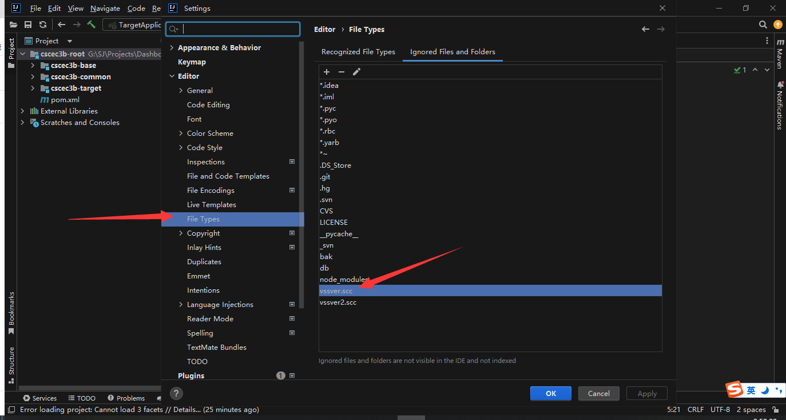

在IntelliJ IDEA中隐藏特定文件夹(如ABCD文件夹)的操作步骤如下：

1. 打开设置界面：
   - 通过菜单栏 File → Settings (Windows/Linux)
   - 或使用快捷键 Ctrl+Alt+S

2. 导航到文件类型设置：
   - 选择 Editor → File Types → Ignored Files and Folders

3. 添加要隐藏的文件夹：
   - 在输入框中添加"ABCD"（无需引号）
   - 支持使用通配符，例如"ABCD*"可隐藏所有以ABCD开头的文件夹
   - 多个条目可用分号分隔

4. 应用设置：
   - 按回车确认添加
   - 点击Apply/OK保存设置

补充说明：
- 此操作不会删除文件，只是隐藏显示
- 若要重新显示，只需从忽略列表中删除对应条目
- 避免隐藏重要文件类型（如*.xml），否则相关文件也会被隐藏

引用链接：
1.[idea 如何隐藏/展示不想看到的文件 - t.zoukankan.com](http://t.zoukankan.com/mengjianzhou-p-6177897.html)
2.[在Idea中隐藏指定文件/文件夹_idea隐藏文件夹-CSDN博客 - CSDN博客](https://blog.csdn.net/m0_62036548/article/details/139838839)
3.[使用IDEA如何隐藏文件或文件夹_隐藏.idea文件夹-CSDN博客 - CSDN博客](https://blog.csdn.net/qq_42000661/article/details/145964902)
4.[IDEA使用技巧之教你一招:隐藏指定文件/文件夹 - 腾讯云](https://cloud.tencent.com/developer/article/2153009)
5.[IDEA隐藏不想看到的文件或文件夹 - 博客园](https://www.cnblogs.com/qingpw/p/12860455.html)
6.[idea如何配置不显示某些文件-阿里云开发者社区 - 阿里云开发者社区](https://developer.aliyun.com/article/1494179)
7.[IntelliJ IDEA 2024.2.4显示隐藏的菜单栏 - zhbcombbcc](http://zhuanlan.zhihu.com/p/8133328381)
8.[如何在IntelliJ IDEA项目中隐藏和显示.idea文件夹-百度开发者中心 - 百度开发者中心](https://developer.baidu.com/article/details/2786192)
9.[IDEA中隐藏文件或文件夹_idea隐藏文件夹-CSDN博客 - CSDN博客](https://blog.csdn.net/m0_53912558/article/details/128889788)
10.[IntelliJ IDEA [设置] 隐藏 .idea 等 .XXX 文件夹_idea怎么隐藏.idea-CSDN博客 - CSDN博客](https://blog.csdn.net/yanyc0411/article/details/135213163)
11.[Idea中隐藏不想看到的文件或文件夹(.meta等) - 博客园](https://www.cnblogs.com/yifengs/p/17032577.html)
12.[idea怎么隐藏文件 - 百度经验](https://jingyan.baidu.com/article/a65957f426bc1c65e67f9bb2.html)
13.[idea 不展示文件夹modules idea文件夹显示 - 51CTO博客](https://blog.51cto.com/u_16099206/10445976)
14.[idea隐藏文件 - 博客](https://wenku.csdn.net/answer/5bn3erm7uj)
15.[Intellij IDEA菜单栏不见了(Main Menu as Separate Toolbar)恢复菜单栏显示的解决办法 - 陌上花开](http://zhuanlan.zhihu.com/p/713900073)
16.[IntelliJ IDEA隐藏不想看到的文件或文件夹 - 博客园](https://www.cnblogs.com/warehouse/p/7018875.html%20)
17.[idea隐藏文件设置配置 - 博客](https://wenku.csdn.net/answer/63han32xgn)
18.[IntelliJ IDEA如何隐藏项目路径#校园分享# - 百度经验](https://jingyan.baidu.com/article/d8072ac444fb79ad95cefddf.html)
19.[IDEA忽略文件,防止git提交不想提交的文件的探索 - 腾讯云](https://cloud.tencent.com/developer/article/2038360)
20.[文件夹怎么隐藏和显示,科技,软件,好看视频 - 启蒙兔](https://haokan.baidu.com/v?pd=wisenatural&vid=10641493686522609035)