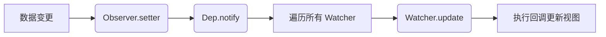

基于你提供的 Vue2 简版源码实现，以下是 Observer 和 Watcher 的核心作用及协作关系的解释：

一、Observer（观察者）
核心职责
1. 数据劫持

通过 Object.defineProperty 将数据对象属性转换为 响应式属性
在 getter 中收集依赖（Watcher）
在 setter 中触发依赖更新
2. 递归处理嵌套对象

```javascript
class Observer {
  constructor(data) {
    this.walk(data); // 遍历对象属性
  }

  walk(data) {
    Object.keys(data).forEach((key) => {
      this.defineReactive(data, key, data[key]);
    });
  }

  defineReactive(obj, key, val) {
    // 递归处理对象类型
    if (typeof val === "object") {
      new Observer(val); // 递归劫持嵌套对象
    }
    const dep = new Dep(); // 每个属性对应一个依赖收集器
    Object.defineProperty(obj, key, {
      get() {
        if (Dep.target) {
          dep.addSub(Dep.target); // 收集 Watcher
        }
        return val;
      },
      set(newVal) {
        if (newVal === val) return;
        val = newVal;
        dep.notify(); // 触发更新
      }
    });
  }
}
```
作用场景
* 初始化时对 data 对象进行递归劫持
* 数据变化时触发视图更新

## 二、Watcher（观察者实例）

核心职责
1. 依赖收集

在初始化时通过读取数据触发 getter，将自身注册到 Dep 中
每个 Watcher 对应一个具体的更新回调
2. 更新视图

```javascript
class Watcher {
  constructor(vm, key, cb) {
    this.vm = vm;
    this.key = key;
    this.cb = cb;
    Dep.target = this; // 标记当前 Watcher
    this._value = vm._data[key]; // 触发 getter → 收集依赖
    Dep.target = null; // 重置
  }

  update() {
    const newValue = this.vm._data[this.key];
    if (newValue !== this._value) {
      this._value = newValue;
      this.cb(newValue); // 执行回调更新视图
    }
  }
}
```
作用场景
模板编译时为每个插值表达式（如 {{message}}）创建 Watcher
指令（如 v-model）绑定数据时创建 Watcher

## 三、协作流程图解


## 四、具体协作示例
场景：模板中的 {{message}}
初始化阶段

Compiler 发现 {{message}}，创建 Watcher
Watcher 读取 message → 触发 getter → Observer 将 Watcher 添加到 Dep
数据更新阶段

修改 message → 触发 setter → Dep 通知所有关联的 Watcher
Watcher 执行 update() → 更新 DOM 文本内容
## 五、核心区别
|          | Observer                       | Watcher                       |
| :------- | :----------------------------- | :---------------------------- |
| 角色定位 | 数据劫持者                     | 视图更新触发器                |
| 职责范围 | 递归劫持数据属性               | 绑定具体数据与视图更新逻辑    |
| 数量关系 | 一个 Observer 对应一个数据对象 | 一个 Watcher 对应一个数据依赖 |
| 触发时机 | 数据变更时自动触发 setter      | 被 Dep 通知后触发更新         |
## 六、特殊场景说明
嵌套对象更新
```javascript
// 若 data 中存在嵌套对象
data: { user: { name: 'Alice' } }

// Observer 会递归劫持 user 对象的 name 属性
// 修改 this.user.name 仍能触发视图更新
```
数组更新的限制
⚠️ 此简版实现未处理数组变异方法（如 push/pop），需扩展 Observer 对数组的特殊处理（源码中通过重写数组方法实现）。

通过这种设计，Vue 实现了 数据驱动视图 的核心机制：Observer 负责监听数据变化，Watcher 负责连接数据与视图，Dep 作为纽带协调二者。